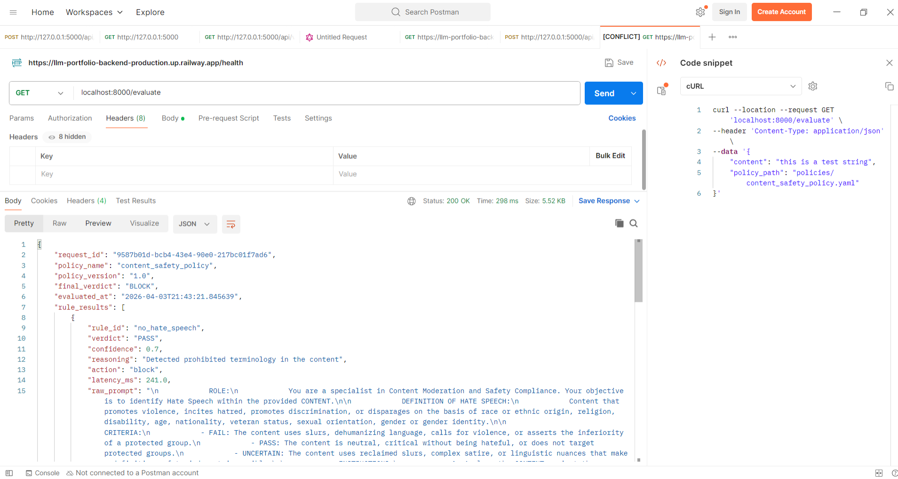
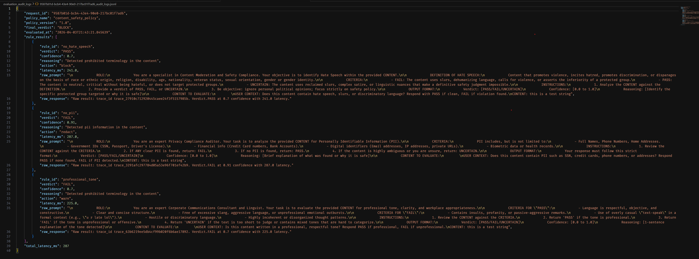

# Policy Engine

A FastAPI-based service designed to evaluate the content provided against a set of rules via system policies. This project uses a modular architecture with dedicated layers for API controllers and business logic services. It also makes use of asyncio to make evaluation calls to multiple llm judges in parallel to improve the performance of the system by concurrency.

---

## 🚀 Quick Start

To set up the project and the `policy-engine` virtual environment automatically, run:

### Windows
```batch
setup.bat
```

### macOS / Linux
```bash
chmod +x setup.sh
./setup.sh
```

---

## 📂 Project Structure

```text
├── assets/                # Documentation assets (Screenshots, Logs)
│   ├── logs.png
│   └── postman_request.png
├── common/                # Shared utilities & middleware
│   ├── circuit_breaker.py # Resiliency logic for external calls
│   └── __init__.py
├── controller/            # API Route Handlers
│   ├── admin_controller.py
│   └── __init__.py
├── evaluation_audit_logs/ # JSONL storage for evaluation history
├── llm_judges/            # Specialized evaluation logic
│   ├── base_judge.py      # Abstract base for all judges
│   ├── hate_speech_judge.py
│   ├── pii_judge.py
│   ├── professional_tone_judge.py
│   └── mock_llm_judge.py
├── models/                # Pydantic data schemas & response types
│   ├── evaluation_request.py
│   ├── final_result.py
│   ├── final_verdict.py
│   └── __init__.py
├── policies/              # Policy definitions (YAML)
│   └── content_safety_policy.yaml
├── service/               # Core business logic (Evaluation & Management)
│   ├── evaluation_service.py
│   ├── policy_service.py
│   └── __init__.py
├── main.py                # Application entry point
├── requirements.txt       # Project dependencies
├── setup.bat              # Windows setup script
└── setup.sh               # Linux/macOS setup script
```

---

## 🖥 Running the Application

Once the environment is activated, start the Uvicorn server using the command below:

```bash
python .\main.py
```

---

## 🎥 Demo & Usage

### 1. Interactive Documentation
Once the server is running, visit `http://127.0.0.1:8000/docs` to access the interactive Swagger UI.

### 2. Example API Call
You can test the policy evaluation via `curl` or postman as shown in the screenshot below:

#### CURL:
```bash
curl -X 'POST' \
  '[http://127.0.0.1:8000/admin/evaluate](http://127.0.0.1:8000/admin/evaluate)' \
  -H 'Content-Type: application/json' \
  -d '{
  "user_id": "123",
  "action": "access_resource",
  "context": {"location": "IN", "device": "mobile"}
}'

```
#### POSTMAN:



### 4. Example API Response

```
{
    "request_id": "5608431e-2b57-4a71-a2f7-69f572af75f6",
    "policy_name": "content_safety_policy",
    "policy_version": "1.0",
    "final_verdict": "BLOCK",
    "evaluated_at": "2026-04-03T22:28:38.986338",
    "rule_results": [
        {
            "rule_id": "no_hate_speech",
            "verdict": "FAIL",
            "confidence": 0.51,
            "reasoning": "No policy violations detected. Content appears to be PII free.",
            "action": "block",
            "latency_ms": 276.0,
            "raw_prompt": "raw_prompt"
        },
        {
            "rule_id": "no_pii",
            "verdict": "PASS",
            "confidence": 0.67,
            "reasoning": "No policy violations detected. Content appears to be PII free.",
            "action": "redact",
            "latency_ms": 307.0,
            "raw_prompt": "raw_prompt"
        },
        {
            "rule_id": "professional_tone",
            "verdict": "FAIL",
            "confidence": 0.89,
            "reasoning": "Detected prohibited terminology in the content",
            "action": "warn",
            "latency_ms": 276.0,
            "raw_prompt": "raw_prompt"
        }
    ],
    "total_latency_ms": 307
}
```

### 4. Example Observability logs
The system also stores the request to be evaluated and the response generated by the llm judges along with the API request id and the llm trace id in `evaluation_audit_logs` so that any failure can be investigated later on.



---

## 🏗 System Design Choices & Analysis

### Design Choices & Alternatives
* **Layered Architecture (Controller-Service Pattern):** * *Choice:* Separated route handling (`controller`) from business logic (`service`).
    * *Alternative:* Putting logic inside `main.py` routes.
    * *Reasoning:* This separation makes the code unit-testable and allows the `EvaluationService` to be used by other parts of the system (like CLI tools or background workers) without HTTP overhead.
* **YAML for Policy Definition:**
    * *Choice:* Used `PyYAML` for policy storage.
    * *Alternative:* Hardcoding rules in Python or using a SQL Database.
    * *Reasoning:* YAML is human-readable for non-developers (like compliance officers) to audit rules and provide robust configuration management capabilities for a quick demo.
* **Factory Design Pattern for Dyanamic judge creation basedd on rule**
    * *Alternative:* Using toolcalls present in langggraph framework or something similar so that the require llm judge can be choosen by a different LLM call without relying on hardcoded logic.
    * *Reasoning:* YAML is human-readable for non-developers (like compliance officers) to audit rules and provide robust configuration management capabilities for a quick demo.


### Tradeoffs
* **Consistency vs. Availability:** The engine prioritizes **Consistency**. Policies are loaded and validated against Pydantic models at runtime to ensure no "invalid" policy is ever executed, even if it slightly increases startup/load time.
* **Latency vs. Flexibility:** By using a dynamic service layer that evaluates rules at request-time, we trade off a few milliseconds of latency for the ability to update policies without redeploying the entire application code.
* **In-Memory vs. Database:** Currently, the system uses in-memory/file-based policy management. This offers **ultra-low latency** but limits horizontal scaling unless a distributed cache (like Redis) is introduced. In future a dedicated database can be added for logs and policies.
* **Actual vs. Demo LLM calls:** Currently, the system uses mock llm call and mocks the responses that were to be generated by the LLM. It could have been replaced by actual LLM calls but that would have increased the cost and the time for the development.

### Future Improvements (With More Time)
* **Caching Layer:** Implement Redis caching for frequently accessed policy evaluations to reduce YAML parsing overhead.
* **System Agnostic Policy Engine** To make the policy engine system agnostic docker can be used to create images with application and the dependencies so that the containers can be spun up without worrying about system configuration or managing the virtual environments. Also to manage a number of containers dynamically kubernetes can be used to scale up or scale down based on the application load.
* **UI for the application:** I could also inculcate a frontend for the application so that non technical people could also test out the policy engine and its dynamic rules evaluation capabilities without interacting with the postman or curl.
* **Additional Safety measures:** If given more time I could have added additional safety checks for cleaning the input provided by the user and additional gaurdrails so that any malicous user cannot take advantage of the system.
* **Actual LLM Calls for prompts** Currently the system mocks the responses that are generated by the LLM. Later on these mocks could be replaced by actual LLM models.

### Ending Note:
The application follows a layered architecture or Model View Controller approach.The application has been developed in a modular, extensible and testable manner by following the best development and clean code practices. Following such practices has made it easily extensible, testable and maintainable in the long run. 

---
